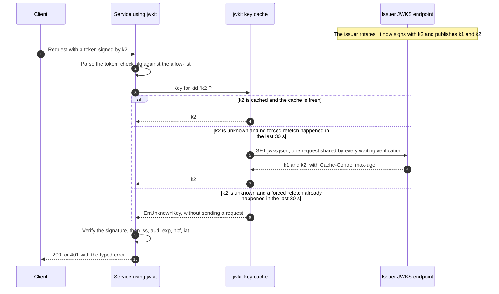

# jwkit

[](https://github.com/ArianKhademi/jwkit/actions/workflows/ci.yml)
[](#coverage)
[](#coverage)
[](https://pkg.go.dev/github.com/ArianKhademi/jwkit/go)
[](https://www.npmjs.com/package/@ariankhademi/jwkit)
[](LICENSE)

jwkit is a small authentication SDK that services use to verify JWTs issued by
an identity provider with a JWKS endpoint (Auth0, Clerk, Cognito, Keycloak, or
an in-house issuer). It exists twice, as a Go module and a TypeScript package,
with one behaviour: the same checks in the same order, the same typed errors,
the same key-rotation-aware JWKS cache, and drop-in middleware for Gin and
Express. A conformance suite that runs in CI holds the two implementations to
that: they must accept and reject the same tokens, and reject them with the
same error.

- [Use it](#use-it)
- [What is checked](#what-is-checked)
- [Key rotation](#key-rotation)
- [Threats and the tests that cover them](#threats-and-the-tests-that-cover-them)
- [Conformance: one behaviour in two languages](#conformance-one-behaviour-in-two-languages)
- [Coverage](#coverage)
- [Fuzzing and property tests](#fuzzing-and-property-tests)
- [Benchmarks](#benchmarks)
- [Design decisions](#design-decisions)
- [Reference](#reference): configuration, middleware options, CLI, development
- [Limits](#limits)
- [How this was built](#how-this-was-built)

## Use it

### Go

```sh
go get github.com/ArianKhademi/jwkit/go
```

```go
verifier, err := jwkit.NewVerifier(jwkit.Config{
	Issuer:   "https://your-tenant.example/",
	Audience: "https://api.example.com",
	JWKSURL:  "https://your-tenant.example/.well-known/jwks.json", // omit to use OIDC discovery
})
if err != nil {
	log.Fatal(err)
}

r := gin.Default()
r.Use(jwkit.GinMiddleware(verifier))
r.GET("/me", func(c *gin.Context) {
	c.JSON(http.StatusOK, gin.H{"sub": jwkit.GinClaims(c).Subject})
})
```

The import path is `jwkit "github.com/ArianKhademi/jwkit/go"`. Without Gin:
`claims, err := verifier.Verify(ctx, token)`, then `errors.Is(err, jwkit.ErrExpired)`.

### TypeScript

```sh
npm install @ariankhademi/jwkit
```

```ts
import express from 'express'
import { jwkitExpress, Verifier } from '@ariankhademi/jwkit'

const verifier = new Verifier({
  issuer: 'https://your-tenant.example/',
  audience: 'https://api.example.com',
  jwksUrl: 'https://your-tenant.example/.well-known/jwks.json', // omit to use OIDC discovery
})

const app = express()
app.use(jwkitExpress(verifier))
app.get('/me', (req, res) => {
  res.json({ sub: req.auth?.sub })
})
```

Without Express: `const claims = await verifier.verify(token)`, then
`err instanceof ErrExpired` or `err.code === 'ErrExpired'`.

### What a rejected request looks like

Both middlewares answer identically:

```
HTTP/1.1 401 Unauthorized
WWW-Authenticate: Bearer error="invalid_token", error_description="ErrExpired"
Content-Type: application/json

{"error":"ErrExpired"}
```

| Situation | Status | Body | `WWW-Authenticate` |
|---|---|---|---|
| No token on the request | 401 | `{"error":"ErrMissingToken"}` | `Bearer` |
| Token fails verification | 401 | `{"error":"<typed error>"}` | `Bearer error="invalid_token", error_description="<typed error>"` |
| Valid token, missing a required scope or role | 403 | `{"error":"ErrInsufficientScope"}` | `Bearer error="insufficient_scope", ...` |
| Issuer's keys cannot be fetched and none are cached | 503 | `{"error":"ErrJWKSUnavailable"}` | none |

Only the error's name reaches the client. The detail (which claim, which key)
stays on the server, in the error value.

Runnable servers are in [`examples/`](examples); `make examples` starts both
against an in-repo test issuer and checks every row of that table.

## What is checked

A token is verified in a fixed order, and the first failure decides the error.
The order is the same in both languages, so a token that is wrong in several
ways gets the same error from both.

| # | Check | Error |
|---|---|---|
| 1 | At most 8192 bytes (configurable); exactly three segments; each canonical, unpadded base64url; header and payload are UTF-8 JSON objects nested at most 64 levels deep | `ErrMalformed` |
| 2 | `alg` is a string | `ErrMalformed` |
| 3 | `alg` is `RS256` or `ES256`. Nothing else: not `none`, not any HMAC algorithm | `ErrUnsupportedAlg` |
| 4 | No `crit` header; `kid` is a non-empty string | `ErrMalformed` |
| 5 | The issuer's JWKS has a usable key with that `kid` | `ErrUnknownKey` |
| 6 | That key is for the token's algorithm, and the signature verifies | `ErrBadSignature` |
| 7 | `iss` equals the configured issuer, exactly | `ErrBadIssuer` |
| 8 | `aud` is, or contains, the configured audience | `ErrBadAudience` |
| 9 | `exp` is present, and `exp`, `nbf`, `iat` are finite numbers | `ErrMalformed` |
| 10 | `exp` is in the future (60 s clock skew by default) | `ErrExpired` |
| 11 | `nbf` and `iat` are not in the future (same skew) | `ErrNotYetValid` |

Claims are examined only after the signature has verified, so the error never
describes a payload nobody has vouched for.

The error names are a contract shared by both languages. Seven come from the
original specification (`ErrMalformed`, `ErrUnsupportedAlg`, `ErrUnknownKey`,
`ErrBadSignature`, `ErrBadIssuer`, `ErrBadAudience`, `ErrExpired`). Four were
added because nothing in those seven fits: `ErrNotYetValid` for `nbf`/`iat`,
`ErrJWKSUnavailable` when there are no keys to verify with, and
`ErrMissingToken` and `ErrInsufficientScope` in the middleware.

## Key rotation

Identity providers rotate signing keys. A verifier that fetched the JWKS once
at startup starts rejecting valid tokens the moment that happens; one that
refetches on every unknown `kid` can be made to hammer the issuer by anyone
who sends tokens with made-up `kid`s. jwkit does neither.



What the cache guarantees, each with the test that demonstrates it (the Go test
is named; the TypeScript suite has the same test in `ts/test/jwks.test.ts`):

| Guarantee | Test |
|---|---|
| The JWKS is fetched on first use and cached by `kid` for 10 minutes (configurable) | `TestJWKSIsFetchedLazilyAndCached`, `TestCacheTTL` |
| `Cache-Control: max-age` from the issuer overrides that TTL, clamped to between the refetch interval and 24 hours | `TestCacheTTL`, `TestCacheControlMaxAge` |
| A token with an unknown `kid` triggers exactly one refetch, and tokens signed by the old key keep verifying meanwhile | `TestKeyRotation` |
| 100 tokens with made-up `kid`s cause one refetch, not 100 (at most one forced refetch per 30 s) | `TestUnknownKidRefetchIsRateLimited` |
| 200 concurrent verifications during a rotation share a single request, and all succeed | `TestConcurrentVerificationsShareOneFetch` |
| A key the issuer has removed stops verifying at the next refresh: the cache is replaced, never merged | `TestKeyRotation` |
| If a refresh fails (HTTP error, bad JSON, no usable key, oversized body, connection refused) the last good keys stay in use, a warning hook is called, and nothing is retried for 30 s | `TestRefreshFailureKeepsLastGoodKeys` |
| With no keys at all, verification fails with `ErrJWKSUnavailable`, and recovers by itself | `TestJWKSUnavailableOnFirstUse` |
| A malformed or wrong-algorithm token never causes a network request | `TestMalformedTokenNeverTouchesTheNetwork` |

## Threats and the tests that cover them

Conformance cases (in `code font`, from [`conformance/fixtures.json`](conformance/fixtures.json))
run against both implementations. Go tests are in `go/`; the TypeScript suite
mirrors them.

| Attack | How jwkit stops it | Proof |
|---|---|---|
| **`alg: none`**: strip the signature and declare the token unsigned | `alg` is checked against an allow-list of `RS256` and `ES256` before anything else is done with the token | `alg-none`, `alg-none-with-kid`, `alg-none-mixed-case`, `alg-none-with-signature` |
| **Algorithm confusion**: sign with HS256 using the issuer's RSA *public* key as the HMAC secret | No symmetric algorithm is ever accepted. Independently, every cached key is bound to the one algorithm its type supports, so the header cannot choose how a key is used | `hs256-rsa-public-key-pem`, `hs256-rsa-public-key-der`, `es256-header-rsa-kid`, `rs256-header-ec-kid` |
| **Tampering** with header, payload or signature | The signature is verified over the exact bytes received | `tampered-payload`, `tampered-header`, `tampered-signature`, `signature-from-another-token`; property test "a flipped bit in any segment"; `FuzzVerify` |
| **Key injection**: point `jku` or `x5u` at an attacker's key set, or embed a key in `jwk` | Those headers are never read. Keys come only from the configured JWKS URL | `jku-injection-issuer-kid`, `jku-injection-attacker-kid`, `x5u-injection-issuer-kid`, `embedded-jwk-attacker-key`, `valid-jku-x5u-ignored`; `TestKeyLocationHeadersAreIgnored` asserts the attacker's URL receives zero requests |
| **Forged signer**: sign with another key and reuse the issuer's `kid`, or use an unknown `kid` | The key is looked up by `kid` in the issuer's JWKS only | `wrong-key-same-kid`, `unknown-kid` |
| **Flooding the issuer** with refetches by spraying random `kid`s | Forced refetches are rate limited and concurrent ones collapse into one request | `TestUnknownKidRefetchIsRateLimited`, `TestConcurrentVerificationsShareOneFetch` |
| **Replay of an old token**, or use of one before its time | `exp` is mandatory; `exp`, `nbf` and `iat` are enforced with a bounded skew | `expired`, `expired-at-skew-boundary`, `missing-exp`, `not-yet-valid`, `issued-in-the-future` |
| **Token meant for another service or issuer** | `aud` must contain the configured audience and `iss` must equal the configured issuer, exactly | `wrong-audience`, `missing-audience`, `audience-array-without-ours`, `wrong-issuer`, `issuer-trailing-slash` |
| **Signature malleability**: a second spelling of a valid token (non-canonical base64, DER-encoded or padded ECDSA signature) that slips past a revocation list or cache keyed on the token | Base64url must be canonical; an ES256 signature must be exactly 64 bytes | `non-canonical-base64-signature`, `es256-der-signature`, `es256-signature-extra-byte`; `FuzzParse` and `FuzzVerify` assert no accepted token has a twin |
| **Parser differential**: a token one service's parser reads differently from another's | Parsing is strict and identical in both languages, including the corners where Go and JavaScript disagree by default | `newline-inside-header`, `payload-byte-order-mark`, `payload-invalid-utf8`, `exp-overflows-double`, `valid-duplicate-alg-last-wins`, `claims-inside-proto-member`, `nesting-over-depth-limit`; the differential test |
| **Weak or misused keys in the JWKS**: RSA under 2048 bits, encryption keys, wrong curve, a private key published by mistake | Such keys are never loaded; only the public members of a JWK are ever parsed | `weak-rsa-key`, `encryption-key`, `p384-key-for-es256`, `key-pinned-to-ps256`; `TestParseJWKS` |
| **Retired key**: a token signed by a key the issuer has withdrawn | Each refresh replaces the cached key set | `TestKeyRotation` |
| **Resource exhaustion** with a huge or deeply nested token | The size limit is enforced before any parsing; nesting depth is limited | `one-byte-over-size-limit`, `extremely-long-token`, `nesting-over-depth-limit` |
| **Issuer outage or a poisoned JWKS response** | A response that fails to parse, or has no usable key, never replaces a good cache | `TestRefreshFailureKeepsLastGoodKeys` |
| **Discovery mix-up**: a discovery document that describes a different issuer | The document's `issuer` must equal the configured one | `TestDiscoveryFailures` |
| **Unknown critical extensions**, nested tokens, JWE-shaped input | A `crit` header is refused; a payload that is itself a JWT, and five-segment input, are malformed | `crit-header`, `nested-jwt`, `five-segments` |

## Conformance: one behaviour in two languages

[`conformance/fixtures.json`](conformance/fixtures.json) holds the test key
pairs, the JWKS the issuer publishes, and a list of tokens, each with the
result every implementation must produce: `ok`, or the name of a typed error.
It is produced by one generator, [`conformance/gen_fixtures.go`](conformance/gen_fixtures.go),
which signs with the Go standard library only, so neither JOSE library under
test produced its own vectors. Generation is deterministic, and CI fails if
the committed file is not what the generator produces.

A runner per language ([`run_go`](conformance/run_go/main.go),
[`run_ts`](conformance/run_ts/run.mts)) serves that JWKS from an in-process
HTTP server, verifies every token with a fresh verifier at the fixtures' fixed
clock, and writes `[{name, result}]` as JSON. The CI job `conformance` then
requires three things: each runner's results equal the expectations; the two
result files are byte-identical under `diff`; and the table below is what
those results render to. `make conformance` does the same locally and rewrites
the table.

<!-- conformance:start -->
116 cases, 116 identical results across the fixture expectation, Go and TypeScript.

| Expected result | Cases | Go agrees | TypeScript agrees |
|---|---:|---:|---:|
| `ok` | 19 | 19 | 19 |
| `ErrExpired` | 4 | 4 | 4 |
| `ErrNotYetValid` | 2 | 2 | 2 |
| `ErrMalformed` | 46 | 46 | 46 |
| `ErrBadIssuer` | 6 | 6 | 6 |
| `ErrBadAudience` | 5 | 5 | 5 |
| `ErrBadSignature` | 16 | 16 | 16 |
| `ErrUnknownKey` | 6 | 6 | 6 |
| `ErrUnsupportedAlg` | 12 | 12 | 12 |

<details>
<summary>All 116 cases</summary>

| Case | What the token is | Go | TypeScript |
|---|---|---|---|
| `valid-rs256` | A well-formed RS256 token from the issuer. | `ok` | `ok` |
| `valid-es256` | A well-formed ES256 token from the issuer. | `ok` | `ok` |
| `valid-aud-array` | aud is an array that contains the expected audience. | `ok` | `ok` |
| `valid-aud-array-mixed-types` | Non-string aud entries are ignored, not fatal. | `ok` | `ok` |
| `valid-no-iat-no-nbf` | iat and nbf are optional. | `ok` | `ok` |
| `valid-fractional-exp` | NumericDate may have a fractional part. | `ok` | `ok` |
| `valid-exp-within-skew` | Expired 59 s ago, inside the 60 s clock skew. | `ok` | `ok` |
| `valid-nbf-within-skew` | Not valid for another 60 s, inside the clock skew. | `ok` | `ok` |
| `valid-iat-within-skew` | Issued 60 s in the future, inside the clock skew. | `ok` | `ok` |
| `valid-huge-exp` | exp far beyond any calendar (1e300) is still a finite number. | `ok` | `ok` |
| `valid-jku-x5u-ignored` | A genuine token whose header also carries jku and x5u. They must be ignored, not followed. | `ok` | `ok` |
| `valid-unknown-header-members` | Header members jwkit does not know are ignored. | `ok` | `ok` |
| `valid-no-typ` | typ is optional. | `ok` | `ok` |
| `valid-duplicate-alg-last-wins` | Duplicate header member: both JSON parsers keep the last one, RS256. | `ok` | `ok` |
| `valid-whitespace-around-json` | JSON whitespace before and after the header and payload objects. | `ok` | `ok` |
| `valid-prototype-named-claims` | Claims named __proto__ and constructor are ordinary claims. | `ok` | `ok` |
| `valid-at-size-limit` | A valid token of exactly 8192 bytes, the size limit. | `ok` | `ok` |
| `expired` | exp is an hour in the past. | `ErrExpired` | `ErrExpired` |
| `expired-es256` | The same, for an ES256 token. | `ErrExpired` | `ErrExpired` |
| `expired-at-skew-boundary` | exp + skew equals now exactly: no longer valid. | `ErrExpired` | `ErrExpired` |
| `exp-underflows-to-zero` | exp is 1e-400, which every double parser reads as 0. | `ErrExpired` | `ErrExpired` |
| `not-yet-valid` | nbf is 61 s in the future, just outside the clock skew. | `ErrNotYetValid` | `ErrNotYetValid` |
| `issued-in-the-future` | iat is an hour in the future. | `ErrNotYetValid` | `ErrNotYetValid` |
| `missing-exp` | A token without exp never expires; jwkit requires exp. | `ErrMalformed` | `ErrMalformed` |
| `exp-is-a-string` | exp must be a JSON number. | `ErrMalformed` | `ErrMalformed` |
| `exp-overflows-double` | exp is 1e400: Infinity in JavaScript, a range error in Go. Both must reject it. | `ErrMalformed` | `ErrMalformed` |
| `nbf-is-a-string` | nbf must be a JSON number when present. | `ErrMalformed` | `ErrMalformed` |
| `iat-is-null` | A present-but-null iat is not a number. | `ErrMalformed` | `ErrMalformed` |
| `wrong-issuer` | Signed by the right key but iss names someone else. | `ErrBadIssuer` | `ErrBadIssuer` |
| `missing-issuer` | No iss claim. | `ErrBadIssuer` | `ErrBadIssuer` |
| `issuer-is-an-array` | iss must be a string. | `ErrBadIssuer` | `ErrBadIssuer` |
| `issuer-trailing-slash` | Issuer comparison is exact; no URL normalisation. | `ErrBadIssuer` | `ErrBadIssuer` |
| `wrong-audience` | aud names a different API. | `ErrBadAudience` | `ErrBadAudience` |
| `missing-audience` | No aud claim. | `ErrBadAudience` | `ErrBadAudience` |
| `audience-array-without-ours` | aud is an array that lacks the expected audience. | `ErrBadAudience` | `ErrBadAudience` |
| `audience-is-a-number` | aud must be a string or an array. | `ErrBadAudience` | `ErrBadAudience` |
| `wrong-issuer-and-expired` | Two faults: the issuer check comes first. | `ErrBadIssuer` | `ErrBadIssuer` |
| `wrong-audience-and-expired` | Two faults: the audience check comes before expiry. | `ErrBadAudience` | `ErrBadAudience` |
| `claims-inside-proto-member` | The real claims sit under a member named __proto__. JavaScript code that copies the payload with assignment semantics (Object.assign) would turn that member into the object's prototype and then find the claims on it. | `ErrBadIssuer` | `ErrBadIssuer` |
| `tampered-payload` | sub changed to admin after signing. | `ErrBadSignature` | `ErrBadSignature` |
| `tampered-signature` | One bit of the signature flipped. | `ErrBadSignature` | `ErrBadSignature` |
| `tampered-header` | One header member changed after signing. | `ErrBadSignature` | `ErrBadSignature` |
| `wrong-key-same-kid` | Signed by the attacker's key but labelled with the issuer's kid. | `ErrBadSignature` | `ErrBadSignature` |
| `signature-from-another-token` | A genuine signature transplanted onto different claims. | `ErrBadSignature` | `ErrBadSignature` |
| `empty-signature` | An RS256 header with the signature removed. | `ErrBadSignature` | `ErrBadSignature` |
| `expired-and-tampered` | Two faults: the signature is checked before any claim. | `ErrBadSignature` | `ErrBadSignature` |
| `es256-header-rsa-kid` | An ES256 token whose kid names the RSA key. A key is only ever used with its own algorithm. | `ErrBadSignature` | `ErrBadSignature` |
| `rs256-header-ec-kid` | An RS256 token whose kid names the EC key. | `ErrBadSignature` | `ErrBadSignature` |
| `es256-tampered-payload` | ES256: sub changed to admin after signing. | `ErrBadSignature` | `ErrBadSignature` |
| `es256-tampered-signature` | ES256: one bit of the signature flipped. | `ErrBadSignature` | `ErrBadSignature` |
| `es256-der-signature` | A correct ECDSA signature in ASN.1 DER instead of the 64-byte r\|\|s form JWS requires. | `ErrBadSignature` | `ErrBadSignature` |
| `es256-signature-extra-byte` | A correct r\|\|s signature with a zero byte prepended (65 bytes). | `ErrBadSignature` | `ErrBadSignature` |
| `embedded-jwk-attacker-key` | Signed by the attacker, who helpfully embeds their own public key in the jwk header. | `ErrBadSignature` | `ErrBadSignature` |
| `jku-injection-issuer-kid` | Signed by the attacker, issuer's kid, jku pointing at the attacker's JWKS. | `ErrBadSignature` | `ErrBadSignature` |
| `x5u-injection-issuer-kid` | Signed by the attacker, issuer's kid, x5u pointing at the attacker's certificate. | `ErrBadSignature` | `ErrBadSignature` |
| `unknown-kid` | Signed by a key the issuer never published. | `ErrUnknownKey` | `ErrUnknownKey` |
| `jku-injection-attacker-kid` | Signed by the attacker under their own kid, with jku pointing at a JWKS that contains it. | `ErrUnknownKey` | `ErrUnknownKey` |
| `weak-rsa-key` | Correctly signed by a published 1024-bit RSA key. Keys under 2048 bits are never loaded. | `ErrUnknownKey` | `ErrUnknownKey` |
| `p384-key-for-es256` | Signed (ECDSA, SHA-256) by a published P-384 key. Only P-256 keys are loaded for ES256. | `ErrUnknownKey` | `ErrUnknownKey` |
| `encryption-key` | Correctly signed by a published key marked use=enc. Encryption keys are never loaded. | `ErrUnknownKey` | `ErrUnknownKey` |
| `key-pinned-to-ps256` | Correctly signed (RS256) by a published key whose JWK says alg=PS256. The key's own alg is respected. | `ErrUnknownKey` | `ErrUnknownKey` |
| `alg-none` | The classic: {"alg":"none"} and an empty signature. | `ErrUnsupportedAlg` | `ErrUnsupportedAlg` |
| `alg-none-with-kid` | alg none, naming the issuer's key. | `ErrUnsupportedAlg` | `ErrUnsupportedAlg` |
| `alg-none-mixed-case` | "nOnE": case tricks do not help. | `ErrUnsupportedAlg` | `ErrUnsupportedAlg` |
| `alg-none-with-signature` | alg none, but carrying a genuine RS256 signature for the original header. | `ErrUnsupportedAlg` | `ErrUnsupportedAlg` |
| `hs256-rsa-public-key-pem` | Algorithm confusion: HS256 keyed with the issuer's RSA public key in PEM form. | `ErrUnsupportedAlg` | `ErrUnsupportedAlg` |
| `hs256-rsa-public-key-der` | Algorithm confusion: HS256 keyed with the issuer's RSA public key in DER form. | `ErrUnsupportedAlg` | `ErrUnsupportedAlg` |
| `alg-hs384` | No HMAC algorithm is accepted. | `ErrUnsupportedAlg` | `ErrUnsupportedAlg` |
| `alg-rs384` | RS384 is not on the allow-list. | `ErrUnsupportedAlg` | `ErrUnsupportedAlg` |
| `alg-ps256` | PS256 is not on the allow-list. | `ErrUnsupportedAlg` | `ErrUnsupportedAlg` |
| `alg-es384` | ES384 is not on the allow-list. | `ErrUnsupportedAlg` | `ErrUnsupportedAlg` |
| `alg-lower-case` | "rs256": algorithm names are case-sensitive. | `ErrUnsupportedAlg` | `ErrUnsupportedAlg` |
| `alg-empty` | alg is the empty string. | `ErrUnsupportedAlg` | `ErrUnsupportedAlg` |
| `alg-missing` | No alg member at all. | `ErrMalformed` | `ErrMalformed` |
| `alg-is-a-number` | alg must be a string. | `ErrMalformed` | `ErrMalformed` |
| `alg-member-upper-case` | The member is spelled "ALG". Member names are case-sensitive, so there is no alg. | `ErrMalformed` | `ErrMalformed` |
| `alg-inside-proto-member` | alg and kid sit under a member named __proto__, where only code that lets it become the object's prototype would find them. | `ErrMalformed` | `ErrMalformed` |
| `missing-kid` | No kid: jwkit never guesses which key to try. | `ErrMalformed` | `ErrMalformed` |
| `empty-kid` | kid is the empty string. | `ErrMalformed` | `ErrMalformed` |
| `kid-is-a-number` | kid must be a string. | `ErrMalformed` | `ErrMalformed` |
| `crit-header` | A crit header demands extensions jwkit does not implement (RFC 7515, 4.1.11). | `ErrMalformed` | `ErrMalformed` |
| `empty-token` | The empty string. | `ErrMalformed` | `ErrMalformed` |
| `one-segment` | No dots at all. | `ErrMalformed` | `ErrMalformed` |
| `two-segments` | Header and payload, no signature segment. | `ErrMalformed` | `ErrMalformed` |
| `four-segments` | One segment too many. | `ErrMalformed` | `ErrMalformed` |
| `five-segments` | Five segments: the shape of a JWE. | `ErrMalformed` | `ErrMalformed` |
| `only-dots` | Three empty segments. | `ErrMalformed` | `ErrMalformed` |
| `bearer-prefix` | The Authorization header value, "Bearer " included, passed as the token. | `ErrMalformed` | `ErrMalformed` |
| `leading-space` | A space before the token. | `ErrMalformed` | `ErrMalformed` |
| `trailing-newline` | A newline after the token. | `ErrMalformed` | `ErrMalformed` |
| `newline-inside-header` | A line break inside a segment. Go's base64 decoder would skip it silently. | `ErrMalformed` | `ErrMalformed` |
| `invalid-base64url-header` | A character outside the base64url alphabet in the header. | `ErrMalformed` | `ErrMalformed` |
| `invalid-base64url-payload` | A character outside the base64url alphabet in the payload. | `ErrMalformed` | `ErrMalformed` |
| `invalid-base64url-signature` | A character outside the base64url alphabet in the signature. Node's decoder would skip it silently. | `ErrMalformed` | `ErrMalformed` |
| `standard-base64-alphabet` | The signature uses '+', from the standard rather than URL-safe alphabet. | `ErrMalformed` | `ErrMalformed` |
| `padded-base64` | The signature carries '=' padding. | `ErrMalformed` | `ErrMalformed` |
| `impossible-base64-length` | A signature segment whose length is 1 mod 4, which no byte string encodes to. | `ErrMalformed` | `ErrMalformed` |
| `non-canonical-base64-signature` | Only the unused trailing bits of the signature's last character differ. A lenient decoder would accept this as the same, valid, signature. | `ErrMalformed` | `ErrMalformed` |
| `non-ascii-character` | A non-ASCII letter in the payload segment. | `ErrMalformed` | `ErrMalformed` |
| `header-not-json` | The header decodes to text that is not JSON. | `ErrMalformed` | `ErrMalformed` |
| `header-json-array` | The header is a JSON array. | `ErrMalformed` | `ErrMalformed` |
| `header-json-null` | The header is JSON null. | `ErrMalformed` | `ErrMalformed` |
| `empty-header` | The header segment is empty. | `ErrMalformed` | `ErrMalformed` |
| `payload-not-json` | The payload is truncated JSON. | `ErrMalformed` | `ErrMalformed` |
| `payload-json-string` | The payload is a JSON string, not an object. | `ErrMalformed` | `ErrMalformed` |
| `nested-jwt` | A correctly signed JWT whose payload is another JWT (cty "JWT"). jwkit does not unwrap nested tokens. | `ErrMalformed` | `ErrMalformed` |
| `payload-trailing-data` | A second JSON value after the claims object. | `ErrMalformed` | `ErrMalformed` |
| `payload-stray-brace` | An extra closing brace after the claims object. | `ErrMalformed` | `ErrMalformed` |
| `payload-invalid-utf8` | The payload contains the byte 0xFF, which is not valid UTF-8. Correctly signed. | `ErrMalformed` | `ErrMalformed` |
| `payload-byte-order-mark` | The payload starts with a UTF-8 byte order mark. Correctly signed. JavaScript's TextDecoder would strip it silently. | `ErrMalformed` | `ErrMalformed` |
| `valid-nesting-at-depth-limit` | A claim holding 63 nested arrays: with the payload object itself, depth 64, the limit. | `ok` | `ok` |
| `nesting-over-depth-limit` | One level deeper. JSON parsers disagree about how deep is too deep (Go stops at 10,000, V8 never does), so jwkit sets its own limit. | `ErrMalformed` | `ErrMalformed` |
| `header-nesting-over-depth-limit` | The same limit applies to the header. | `ErrMalformed` | `ErrMalformed` |
| `valid-brackets-inside-strings` | Brackets and an escaped quote inside a string value are text, not nesting. | `ok` | `ok` |
| `one-byte-over-size-limit` | A correctly signed token of 8193 bytes, one over the limit. | `ErrMalformed` | `ErrMalformed` |
| `extremely-long-token` | A correctly signed token of roughly 64 KiB. | `ErrMalformed` | `ErrMalformed` |

</details>
<!-- conformance:end -->

### Beyond the fixed cases: differential testing

The fixtures are cases somebody thought of. [`conformance/mutate.go`](conformance/mutate.go)
generates cases nobody did: character edits of the fixtures, mixed segments,
and headers and payloads that are damaged or generated at random *and then
signed with the issuer's real key*, so they get past the signature check and
into header and claim handling. They have no expected answer. Both runners
verify them and the outputs are diffed: the property under test is only that
Go and TypeScript agree.

CI runs 20,000 mutations with a fixed seed and 20,000 with a seed that is new
on every run. A disagreement prints the seed, and `make differential SEED=<seed>`
replays it. During development, 165,000 mutations over nine seeds produced no
disagreement.

## Coverage

| | Coverage | What is measured | CI gate |
|---|---|---|---|
| Go module `go/` (the library and `cmd/jwkit-cli`) | **99.2%** | statements, the unit `go test -cover` reports | fails below 90% |
| TypeScript package `ts/src` | **100%** | lines (v8) | fails below 90% on lines, statements, branches or functions |

Measured by [CI run 4](https://github.com/ArianKhademi/jwkit/actions/runs/37279460195)
on commit `b50afb0`, with Go 1.26 and Node 22. Later commits changed only
documentation and the conformance report tool, neither of which is part of
the measured code. On every run on `main` the same job writes the numbers it
measured to the `badges` branch, which is where the two badges at the top of
this page read them from.

Go reports statement coverage because that is what its toolchain measures.
Four of the module's 501 statements are not covered: `main()` of the CLI,
which only calls `os.Exit`; the panic in `mustVerifier`, reachable only if
jwx stopped supporting RS256; and two error returns in `importKey` that
cannot happen (encoding a map of decoded JSON values, and extracting a key
jwx has just parsed). In TypeScript, statements, branches and functions are
at 100% as well (`make cover-ts`).

## Fuzzing and property tests

**Go native fuzzing** ([`go/fuzz_test.go`](go/fuzz_test.go)), seeded with the
conformance fixtures:

- `FuzzParse` drives the structural parser. Whatever the input, it must
  return a token or `ErrMalformed`, never panic, and never accept a token
  whose segments have a second base64url spelling.
- `FuzzVerify` drives the whole verifier against the fixture issuer. The
  result must be claims or one of the typed token errors, never a panic. A
  token may be accepted only if an independent oracle agrees (its own lenient
  parsing, then `crypto/rsa` and `crypto/ecdsa` directly), and only if it is
  byte-identical to one of the signed fixtures. The fuzzer cannot forge a
  signature, so any other accepted token would be a second spelling of a
  signed one.

| Run | Budget | Executions | Failures |
|---|---|---|---|
| CI, on every run ([run 4](https://github.com/ArianKhademi/jwkit/actions/runs/37279460195) shown) | 30 s per fuzzer, 4 workers | `FuzzParse` 168,049, `FuzzVerify` 181,465 | 0 |
| Before release, on the released code | 5 min per fuzzer, 10 workers, Apple M4 | `FuzzParse` 5,169,897, `FuzzVerify` 2,888,475 | 0 |
| Earlier, during development | 60 s, then 5 min, per fuzzer | `FuzzParse` 2,254,786 and 7,304,124, `FuzzVerify` 1,795,083 and 7,020,628 | 0 |

Corpus: 435 inputs found by those runs are committed under
[`go/testdata/fuzz`](go/testdata/fuzz) (215 for `FuzzParse`, 220 for
`FuzzVerify`), next to the 115 fixture tokens used as seeds. They are
replayed by every `go test`.

Crashes found: **none**. No panic, no untyped error, no token accepted that
the oracle rejects, and no accepted token that is not one of the signed
fixtures. There was therefore no fuzz-found bug to fix.

**TypeScript property tests** ([`ts/test/property.test.ts`](ts/test/property.test.ts),
fast-check): 16 properties, 9,900 generated cases per run, on every CI run
and every Node version. They assert that `verify()` never throws anything but
a typed error (random bytes, random Unicode, non-string values, arbitrary
JSON headers); that no damaged copy of a valid token is accepted (bit flips
in each segment, replaced characters, truncation, appended text, mixed
segments, header fields injected without re-signing); that key-location
headers added by the legitimate signer change nothing and cause no request;
and that a correctly signed token is accepted exactly when an independent
model of the claim rules says so. They have not found a defect in the
verifier; the one failure they produced was a wrong assertion in a test
(see [How this was built](#how-this-was-built)).

## Benchmarks

`make bench` measures `Verify` with the issuer's keys already cached, so
there is no network I/O: parsing, one signature verification, claim checks.
The benchmark records every call's latency and reports the median and 99th
percentile as well as the mean.

| | CI runner: AMD EPYC 7763, 4 vCPU, linux/amd64 | Laptop: Apple M4, darwin/arm64 |
|---|---:|---:|
| Verify, RS256, cached keys: **p50** | **39.1 µs** | 24.8 µs |
| p99 | 77.7 µs | 89.6 µs |
| mean | 42.5 µs | 28.1 µs |
| Verify, ES256, cached keys: p50 | 85.8 µs | 39.7 µs |
| p99 | 128.2 µs | 114.3 µs |
| Verify, RS256, all cores busy: mean per call | 18.9 µs | 6.8 µs |
| Reject a malformed token | 308 ns | 120 ns |
| Reject an `alg: none` token | 4.6 µs | 1.9 µs |

One RS256 verification allocates 5.2 kB in 62 allocations. The CI column is
from [run 4](https://github.com/ArianKhademi/jwkit/actions/runs/37279460195)
(Go 1.26); every CI run prints its own in the job summary. Both columns are
single runs on shared or busy machines and move by tens of percent between
runs, so read them as orders of magnitude: a cached verification costs tens
of microseconds, and bad tokens are turned away before any cryptography.

## Design decisions

**jwkit owns parsing and policy; the libraries own cryptography.** Signature
verification and JWK decoding are delegated to
[lestrrat-go/jwx](https://github.com/lestrrat-go/jwx) and
[panva/jose](https://github.com/panva/jose). Splitting the token, decoding its
segments, deciding which algorithms and headers are acceptable, validating
claims and naming the error are done by jwkit, in a few hundred lines per
language. That is deliberate. Two JOSE libraries in two languages do not agree
on malformed input, and "both services reject the same tokens" is the product
requirement, so the layer that decides has to be one that can be made
identical and then fuzzed.

**Why jwx and not go-jose.** jwx exposes the two building blocks this design
needs as public API: a signature verifier over raw bytes (`jws.NewVerifier`)
and a JWK parser (`jwk.ParseKey`). go-jose (v4.1.5) verifies only tokens it
has parsed itself (`ParseSigned` then `Verify`), and its parser makes
decisions jwkit needs to make identically in TypeScript. For example it fails
on a token whose `jwk` header is not a valid JWK, where panva/jose, given a
key by the caller, ignores that header. Using go-jose would have meant either
inheriting its parsing decisions or working around them.

**The key decides the algorithm, not the token.** Each key loaded from the
JWKS is stored together with the single algorithm its type allows (RSA:
RS256, P-256: ES256). A token whose header asks for a different algorithm
than its key's fails before any cryptography. This is a second, structural
defence against algorithm confusion, behind the allow-list.

**Strict where libraries are lenient.** Go's base64 decoder skips line
breaks; Node's skips any character outside the alphabet; both accept
non-zero trailing bits. `encoding/json` matches member names
case-insensitively when decoding into structs, replaces invalid UTF-8, and
fails on `1e400`, where `JSON.parse` returns `Infinity`. `TextDecoder` strips
a byte order mark. Go refuses JSON nested more than 10,000 levels deep; V8
has no limit. Each of these is handled explicitly in both implementations,
and each has a conformance case.

**A hand-rolled single-flight in Go.** `golang.org/x/sync/singleflight`
cannot answer "is a fetch already running?" atomically with "am I allowed to
start one?". The cache needs exactly that: a caller that is over the refetch
rate limit must still join a fetch that is in flight. So the cache keeps one
mutex, makes its lookup and its decision under a single acquisition, and does
the network fetch on a separate goroutine outside the lock. The TypeScript
version makes the same two steps without an `await` between them.

**A refresh blocks; it does not serve stale keys in the background.** When
the TTL has run out, verifications wait for the one in-flight refresh. The
alternative, answering from the stale set while refreshing, would accept a
token signed by a withdrawn key once more after the TTL. Blocking makes the
guarantee simple: a key removed from the JWKS stops being accepted within one
TTL.

**503, not 401, when keys cannot be fetched.** If the issuer is down and
nothing is cached, the token may be perfectly good. Telling the client it is
unauthorized would be a lie that makes it discard a valid session.

**Module path.** The Go module lives in `go/`, so its path is
`github.com/ArianKhademi/jwkit/go` and its version tags are `go/vX.Y.Z`. A
module in a subdirectory cannot have the bare repository path.

## Reference

### Configuration

| Go (`jwkit.Config`) | TypeScript (`VerifierConfig`) | Default | Meaning |
|---|---|---|---|
| `Issuer` | `issuer` | required | Exact value of `iss` |
| `Audience` | `audience` | required | Must be, or be in, `aud` |
| `JWKSURL` | `jwksUrl` | discovered | JWKS location. If omitted, `jwks_uri` is taken from `<issuer>/.well-known/openid-configuration`, whose `issuer` must match |
| `ClockSkew` | `clockSkewSec` | 60 s | Tolerance for `exp`, `nbf`, `iat` |
| `CacheTTL` | `cacheTtlSec` | 10 min | Lifetime of a fetched key set, unless the response has `Cache-Control: max-age` |
| `RefetchInterval` | `refetchIntervalSec` | 30 s | Minimum time between refetches forced by unknown `kid`s; also the retry delay after a failed refresh |
| `MaxTokenBytes` | `maxTokenBytes` | 8192 | Longer tokens are rejected before parsing |
| `HTTPClient` | `fetch` | standard | How the JWKS is fetched. Every fetch is also bounded by a 10 s timeout and a 1 MiB body limit |
| `OnWarning` | `onWarning` | none | Called when a refresh fails and the last good keys stay in use |
| `Now` | `now` | system clock | Clock override, for tests and the conformance runners |

### Middleware options

| Go (`jwkit.MiddlewareOptions`) | TypeScript (`MiddlewareOptions`) | Meaning |
|---|---|---|
| `RequiredScopes` | `requiredScopes` | All must be in the `scope` claim (space-delimited) or the `scp` claim |
| `RequiredRoles`, `RolesClaim` | `requiredRoles`, `rolesClaim` | All must be in the roles claim (default `roles`) |
| `TokenExtractor` | `tokenExtractor` | Where the token is read from. Default: `Authorization: Bearer`. Helpers: `CookieToken(name)`, `HeaderToken(name)` (Go), `cookieToken(name)`, `headerToken(name)` (TS) |
| `SkipPaths` | `skipPaths` | Paths that bypass authentication: exact, or a prefix when the entry ends in `*` |

Verified claims are on the Gin context (`jwkit.GinClaims(c)`, stored under
`jwkit.GinClaimsKey`) and on `req.auth` in Express.

### CLI

`jwkit-cli` decodes and verifies a token from standard input, for debugging.

```sh
go install github.com/ArianKhademi/jwkit/go/cmd/jwkit-cli@latest

jwkit-cli verify -issuer https://your-tenant.example/ -audience https://api.example.com < token.txt
jwkit-cli verify -issuer ... -audience ... -jwks-url https://your-tenant.example/keys < token.txt
jwkit-cli verify -issuer ... -audience ... -at 2026-01-31T12:00:00Z < token.txt   # as of a past instant
jwkit-cli decode < token.txt                                                       # no verification
```

`verify` prints a JSON report (`valid`, `error`, `detail`, and the decoded
`header` and `claims`, shown even when the token is rejected) and exits 0 for
a valid token, 1 for an invalid one, 2 for a usage error.

### Development

```sh
make test          # unit tests: Go with the race detector, TypeScript
make cover         # coverage for both, failing below 90%
make fuzz          # Go fuzzers (FUZZTIME=30s each), then the TS property tests
make conformance   # both runners, diff, regenerate the matrix above
make differential  # MUTATIONS=5000 SEED=1 random tokens through both, diffed
make examples      # build both example servers and smoke-test them end to end
make lint          # gofmt, go vet, staticcheck, tsc, eslint
make bench         # Go benchmarks
make fixtures      # regenerate conformance/fixtures.json
```

`cd conformance && go run . -serve :8089` turns the fixture generator into a
small test issuer (JWKS, discovery document, and `/token` to mint a fresh
token), so nothing here needs an external identity provider.

```
go/            Go module: jwkit.go verifier.go jwks.go errors.go gin.go, cmd/jwkit-cli
ts/            npm package: src/{verifier,jwks,errors,express,index}.ts, test/
conformance/   gen_fixtures.go mutate.go serve.go fixtures.json run_go/ run_ts/ report/
examples/      gin-server/ express-server/ smoke.sh
.github/workflows/ci.yml   one workflow, three jobs: go, ts, conformance
```

Requirements: Go 1.25 or newer (the minimum its dependencies allow), Node.js
20 or newer. CI tests Go 1.25 and 1.26 and Node 20, 22 and 24.

## Limits

- RS256 and ES256 only. No EdDSA, no PS256, no HMAC, by design.
- Tokens must carry `kid` and `exp`. Issuers that omit `kid` are not supported.
- JWS compact serialization only. No JWE, no nested JWTs.
- The TypeScript package targets Node.js (it uses `Buffer`); it has not been
  tried on edge runtimes.
- The size limit counts UTF-8 bytes in both languages.
- Both languages treat the JWKS and discovery documents as coming from a
  trusted issuer. They are parsed defensively, but only the token is treated
  as attacker-controlled, and only token handling is covered by the
  conformance suite. Two JWKS documents with exotic, invalid key material
  could in principle be filtered differently by the two libraries.

## How this was built

This project was built with AI coding tools. The working rule was that
generated code is a draft until a test demonstrates it: nothing was counted as
done before a test covered it and that test ran in CI. The facts below are
left for the owner to put into their own words.

What the verification consisted of:

- Table-driven tests for every error type and the happy path, written twice,
  case for case, in Go and TypeScript.
- Go fuzzers with an independent oracle, and fast-check properties with an
  independent model of the claim rules, so the tests do not just restate the
  implementation.
- A conformance suite whose vectors are signed with the Go standard library
  rather than with either library under test, and a differential test that
  needs no expected answers at all.
- Real HTTP in the middleware tests (a Gin router and an Express app on
  loopback ports) and an end-to-end smoke test of the two example servers.
- CI on two Go versions and three Node versions with 90% coverage gates.

Cases where generated code was wrong, and what caught it:

1. **`Scopes()` returned `nil` in Go.** For a token without scopes the Gin
   example answered `{"scopes":null}` where the Express example answered
   `{"scopes":[]}`. Caught by running the two examples side by side
   (`examples/smoke.sh`); fixed in `95e9135`, which also added a unit test
   and made the smoke test assert the body.
2. **Deeply nested JSON was a cross-language gap.** Go's `encoding/json`
   refuses more than 10,000 nested levels; V8's `JSON.parse` has no limit
   (2,000,000 levels parse). With the size limit raised, a token could
   therefore be `ErrMalformed` in Go and accepted in TypeScript. No test had
   caught it, because every generated case nested only a few levels. It was
   found by measuring both parsers while reviewing the limits for this
   README. Fixed with an explicit depth limit in both languages (`fc539d0`,
   `95b7544`), four new conformance vectors and mutations around the limit
   (`3de9f90`).
3. **The CI workflow ran staticcheck on Go 1.25**, which the pinned
   staticcheck release does not support. The first CI run failed on that leg;
   fixed in `43910f5`.
4. **A property test asserted something false about the verifier.** It
   claimed that flipping a bit in the payload always yields
   `ErrBadSignature`. fast-check found a counterexample within 25 runs:
   flipping the first bit turns `{` into `z`, the payload stops being JSON,
   and the token is `ErrMalformed`, because structure is checked before the
   signature. The verifier was right and the generated assertion was wrong;
   it was corrected before being committed.
5. **Two generated table cases did not test what their names said.**
   "Tampered ES256 payload" swapped in a payload identical to the original,
   so the token was valid and, correctly, verified. "Impossible base64
   length" appended one character, which produced a legal length and a bad
   signature rather than a malformed token. Both showed up as failures on
   the first test run and were test bugs, not verifier bugs.

What the fuzzers found: nothing. No crash and no wrongly accepted token in
any run (see [Fuzzing and property tests](#fuzzing-and-property-tests)).
The defects above were found by the conformance work, the examples and
review, not by fuzzing.

## License

[MIT](LICENSE)
